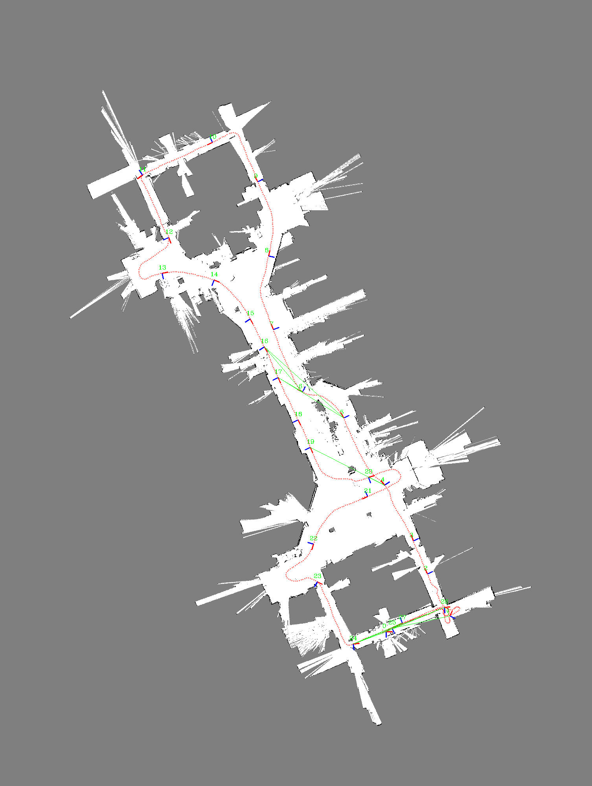
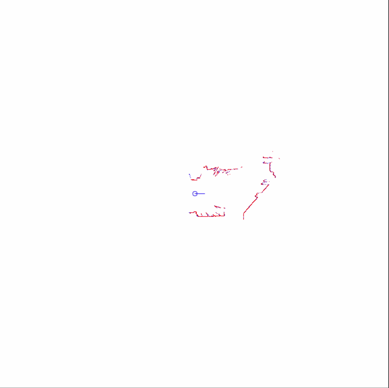
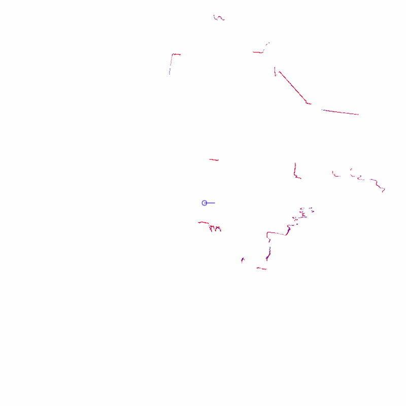
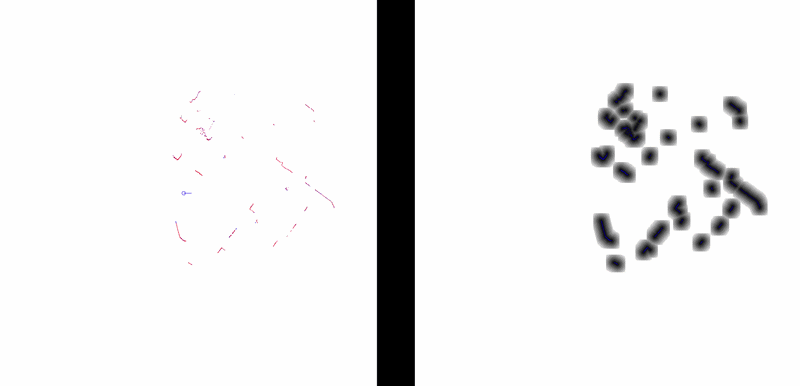
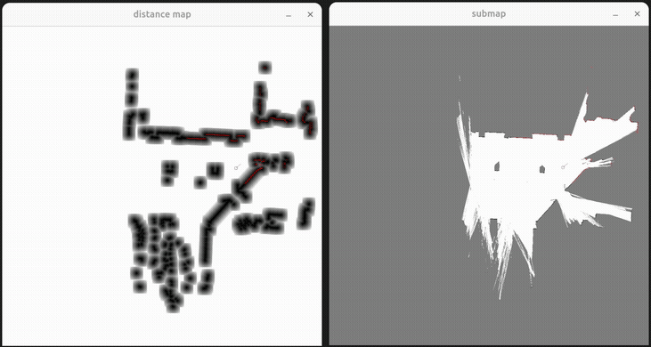
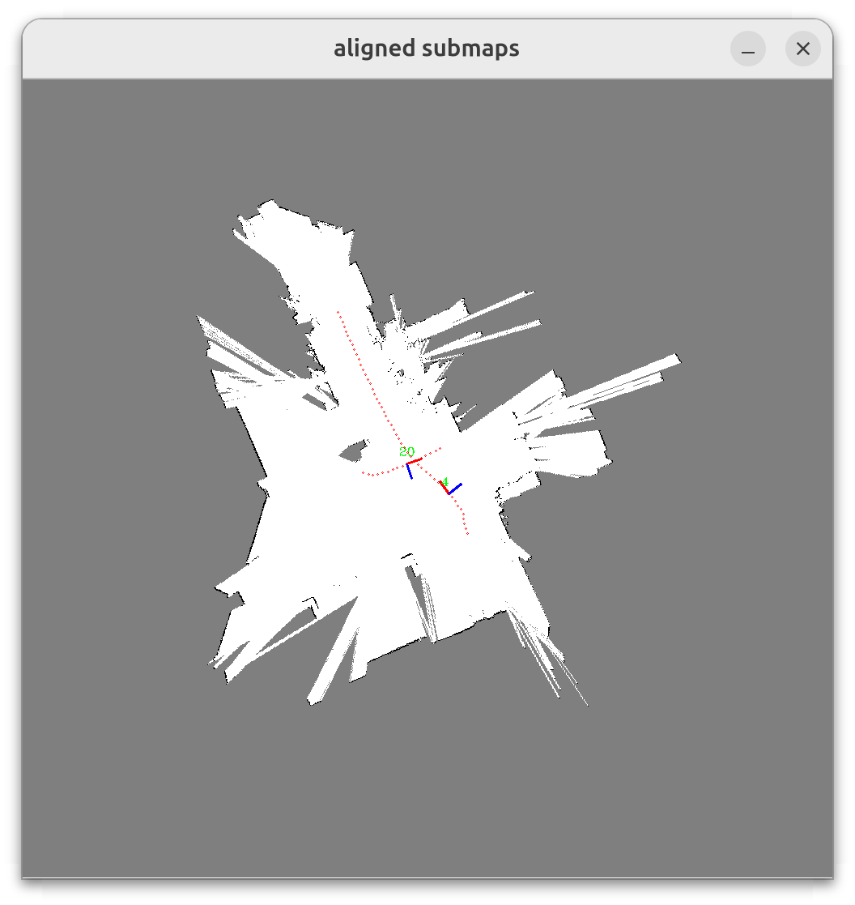
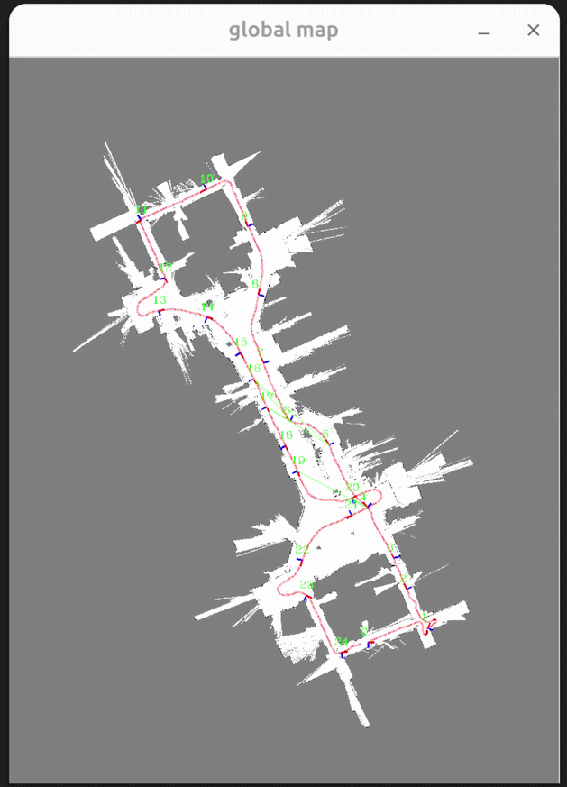

## 2D lidar mapping

### Components

1. 2D mapper
2. 2D point cloud alignment
   - ICP: Point to point
   - ICP: Point to line
   - Likelihood field
3. Submap, Occupancy grid map, likelihood field
4. Loop closure
5. kd tree

### 2D Mapper

Goal: given 2D lidar scan, estimate pose at each time step and create submaps sequentially. The map should be consistent both locally and globally.

#### Procedures

1. Estimate current pose based on the pose and motion of last frame, i.e., $T_{cur} = T_{lst} * T_{motion}$.
2. Align current scan to the submap, compute the the aligned pose of current frame.
3. Create a new keyframe if the motion relative to the last keyframe is over the threshold. The current lidar scan is added to the submap and likelihood field gets updated as well.
4. Detect the loop closure and build and solve pose graph optimization. The accumulated error is reduced in this step.
5. If the scan point leaves current submap or the number of keyframes is over the limit, extend the map by creating new submap which shares a part of keyframes with the last submap.

#### Code

- [source code](src/Mapper2d.cpp)
- [unit test](test/mapper_test.cpp): `./test/mapper_test --optimizer_type=Ceres`
- [main](src/main.cpp): `./src/main`

  

  

### 2D point cloud alignment

Goal: given two set of point cloud, namely target cloud and source cloud, compute the pose of lidar sensor observing source cloud $(x_s, y_s, \alpha_s)$ relative to target cloud observation.

#### ICP: point to point

- Input data: a set of points represented by polar coordinates i.e., $(r, \ \theta)$.

procedures:

1. build a kd tree for the target point cloud: for each target point, compute 2D euclidean coodinates, i.e., $x_{i, t} = r * \cos\theta, \ y_{i, t} = r * \sin\theta$ and add it to kd tree.

2. Compute transform $p = (x_s, y_s, \alpha_s) \in SE(2)$ by solve least square problem min $\sum_i ||e_i||^2$ using Gauss-Newton method. A initial guess should be given.
   - for eacch source point $(r_{i, s}, \theta_{i, s})$, compute the euclidean coordinates and find the nearest neighbors from target cloud $(x_{i, t}, y_{i, t})$.
   - compute error: $e_i = [x_{s} + r_{i, s} * \cos(\alpha_{s} + \theta_{i, s}) - x_{i, t}, \ y_{s} + r_{i, s} * \sin(\alpha_{s} + \theta_{i, s}) - y_{i, t}]^T$
   - compute Jacobian: $J_i =  \begin{bmatrix}1 &0  &-r_{i, s} * \sin(\alpha_s + \theta_{i, s})\\0 & 1 & \hphantom{n} r_{i, s} * \cos(\alpha_s + \theta_{i, s})\end{bmatrix}$
   - solve $\sum_i J_i^T J \Delta * p = \sum_i -J^T_i e_i$
   - update transform $p \leftarrow p + \Delta p$
   - go back to the first step until converge.

- code
  - [source code](src/icp2d.cpp)
  - [unit test](test/icp2d_test.cpp): `./test/icp2d_test --visual_optimizer=Ceres`

    

#### ICP: point to line

1. build a kd tree for the target point cloud: for each target point, compute 2D euclidean coodinates, i.e., $x_{i, t} = r * \cos\theta, \ y_{i, t} = r * \sin\theta$ and add it to kd tree.

2. Compute transform $p = (x_s, y_s, \alpha_s) \in SE(2)$ by solve least square problem min $\sum_i ||e_i||^2$ using Gauss-Newton method. A initial guess should be given.
   - for eacch source point $(r_{i, s}, \theta_{i, s})$, compute the euclidean coordinates and find nearest k neighbors from target cloud and compute a fitting line, i.e., $ax + by + c = 0$.
   - compute error: $e_i = a (x_{s} + r_{i, s} * \cos(\alpha_{s} + \theta_{i, s})) + b (y_s + r_{i, s} \sin(\alpha_s + \theta_{i,s})) + c$
   - compute Jacobian: $J_i = [a, b, -a * r_{i, s} * \sin(\alpha_s + \theta_{i, s}) + b * r_{i,s} * \cos(\alpha_s + \theta_{i, s})]$
   - solve $\sum_i J_i^T J \Delta * p = \sum_i -J^T_i e_i$
   - update transform $p \leftarrow p + \Delta p$
   - go back to the first step until converge.

- code
  - [source code](src/icp2d.cpp)
  - [unit test](test/icp2dp2l_test.cpp): `./test/icp2dp2l_test --optimizer_type=CeresMT`

    

#### Likelihood

1. Build likelihood field of target cloud in which each entry represents the distance to the closest occupied cell hit by target scan point.
   - create a template patch describing the local likelihood field in which only the center is occupied.
   - for each target scan point, use the local template patch to update the global likelihood field. The entry is updated only if the value in local patch is smaller.
2. Compute transform $p = (x_s, y_s, \alpha_s) \in SE(2)$ by solve least square problem min $\sum_i ||e_i||^2$ using Gauss-Newton method. A initial guess should be given.
   - for eacch source point $(r_{i, s}, \theta_{i, s})$, compute the world coordinates $p_{i, w}$ on likelihood field and get distance value $g(p_{i, w})$.
   - compute error: $e_i = g(x_s + r_{i, s} * \cos(\alpha_s + \theta_{i,s}), \ y_s + r_{i, s} * \sin(\alpha_s + \theta_{i,s}))$
   - compute Jacobian $J_i = \beta \cdot [\nabla_x g, \nabla_y g, -\nabla_x g * r_s * \sin(\alpha_s + \theta_{i, s}) + \nabla_y g * r_s * \cos(\alpha_s + \theta_{i, s})]$, where $\beta$ is resolution of likelihood (unit: cell per meter)
   - $\nabla_x g = \frac{g(x + \delta x, \ y) - g(x - \delta x, \ y)}{2\delta x}$, $\nabla_y g = \frac{g(x, \ y + \delta y) - g(x, \ y - \delta y)}{2\delta y}$
   - solve $\sum_i J_i^T J \Delta * p = \sum_i -J^T_i e_i$
   - update transform $p \leftarrow p + \Delta p$
   - go back to the first step until converge.

- code
  - [source code](src/LikelihoodField.cpp)
  - [unit test](test/likelihood_test.cpp): `./test/likelihood_test --optimizer_type=Ceres`

    

#### Code

- [icp source code](src/icp2d.cpp)

### Submap

Goal: create 2D occupancy grid map in which each entry represents status of the space [0-255] from occupied to free. To limit the memory usage and enable the optimization and loop closure in the backend, submaps are created sequentially and each pair of consecutive submaps share a number of frames.

The submap contains an occupancy grid map, likelihood field and an array of inserted keyframes.

#### Procedures

1. Everytime a new source scan received, align source scan to the current submap. The alignment is computed by the likelihood field.
2. Based on the estimated alignment, transform scan point frame from current frame to the local coordinate system of submap. For each scan point, draw a line from robot to the scan point. Update the value of cell in occupancy grid map touched by the line by Bresenham's algorithm. In short, the cells that the line going through approach free status while the cell where the scan point is located at approach occupied status. The likelihood field is also updated.
3. Once the submap reaches to the coverage limit (e.g, number of keyframes, the scan point located outside of submap), save current submap to the disk, create a new submap and copy the last a few number of keyframes to it.

#### Code

- [submap source code](src/Submap.cpp)
- [occupancy grid map source code](src/OGM.cpp)
- [unit test](test/submap_test.cpp): `./test/submap_test --optimizer_type=Ceres`

    

### Loop closure

Goal: eliminate the accumulated error and improve the global consistency during the mapping. Although scan match ensures the local consistency of the submap, the accumulated error increases inevitably and therefore the ghosting appears in the global map.

#### Procedures

1. Detect loop closure candidates: visited submaps that are spatially close but temporally remote to current frame.
2. Align current scan to each submap candidate from coarse to fine, i.e., low resolution to high resolution likelihood field. The initial pose of the alignment is obtained from previous level of alignment.
3. Create and solve pose graph optimization (both g2o and ceres solvers are used).
   - Vertices: poses of submap origin
   - Edges: loop closure factors; relative motion between consecutive submaps.
   - To prevent the mismatch, the Cauchy robust kernel is added to the loop closure edges.
   - Two rounds of optimization: first round optimizes over all edges and mark as outlier if the edge cost is over the threshold defined for the robust kernel. The second round optimization excludes the edges marked as outliers.

#### Code

- [loop closure source code](src/LoopClosure.cpp)
- [multi-level alignment source code](src/LikelihoodFieldMR.cpp)

    
    

### KD tree

Goal: given a query point, find the closest k neighbors from the target point cloud. The implementation should work for point with any dimension.

#### Procedures

- Build kd tree
  1. Split: Given a set of points, compute the mean and variance of points. Select the axis with the highest variance, split the space and create two children nodes.
  2. Recursively call split function for two children nodes and the associated subsets of points.
  3. If the points cannot be split further (e.g., only one node or multiple points with same coordinates), create a leaf node.

- Search k nearest neighbors
  1. Create a priority queue to store the result. Start from the root node.
  2. Choose side: compare the distance between query point and splitting axis. Search further on the closer side.
  3. If the node is a leaf, insert the point to the queue.
  4. If the queue size is smaller than k after searching on one side of the space and the distance between query point and the splitting axis is smaller than the maximum distance in the current results, search on the other side.

#### Code

- [source code](include/mapping2d/KDTree.hpp)
- [unit test](test/kd_test.cpp): `./build/test/kd_test`

## todo

1. map to map icp for loop closure alignment, the match ratio therefore could be much higher than 0.4 for scan to map
2. detect degeneral case, using like line fitting. use different parameters of icp and loop closure in degeneral case
